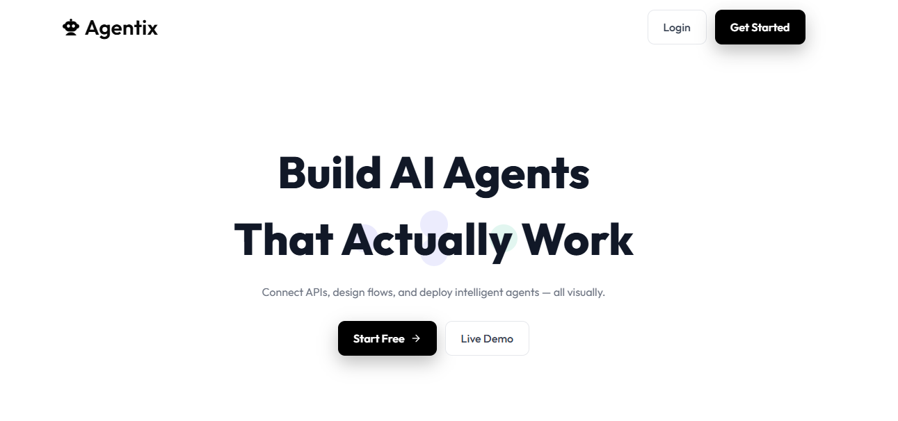
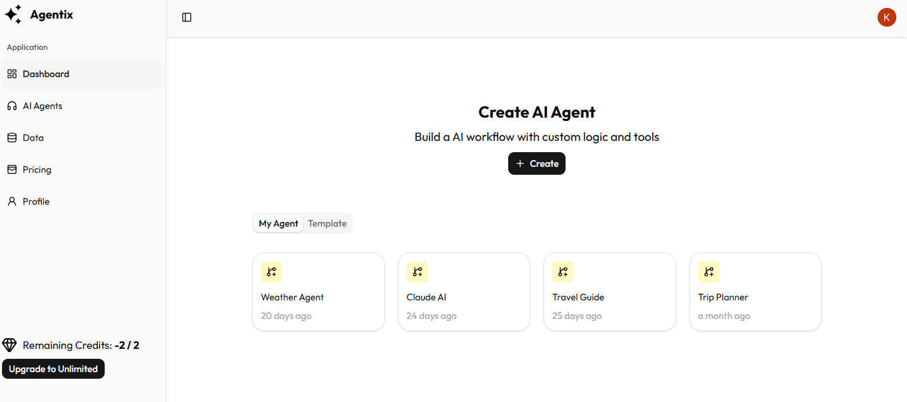
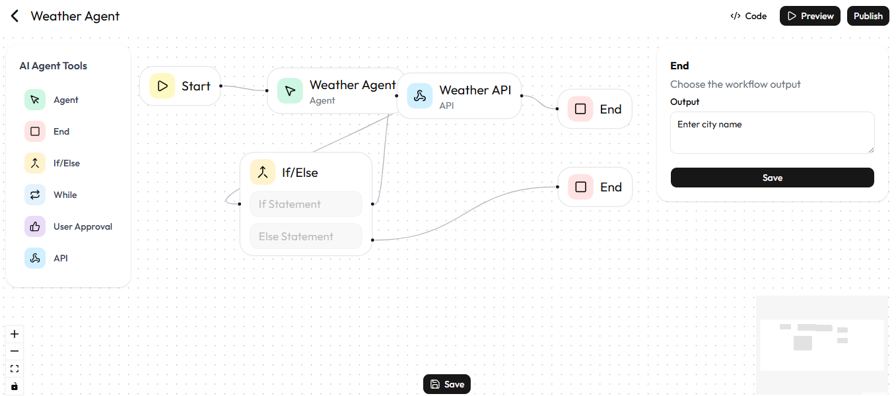
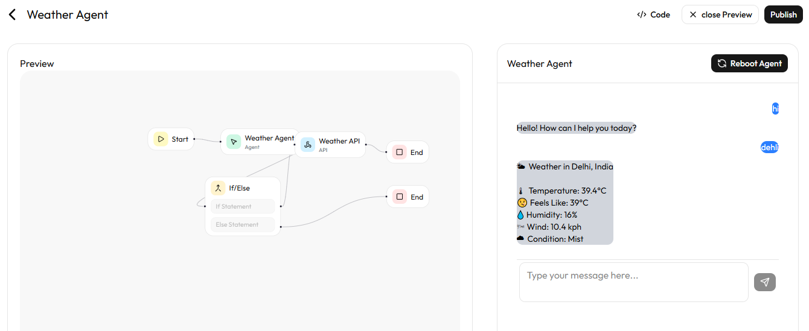
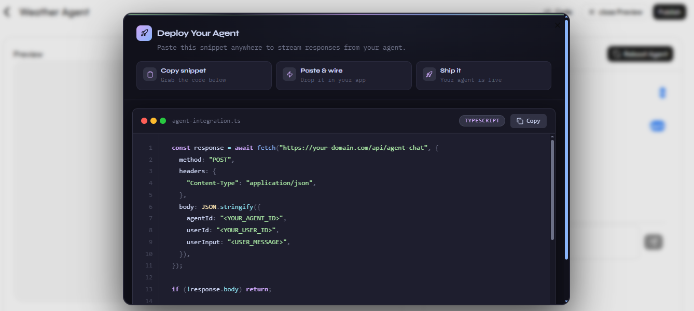

<div align="center">


# ⚡ Agentix

### AI Agent Creation Platform

**Design. Configure. Deploy. — All without writing a single line of agent logic.**

[](https://agentify-ai-zeta.vercel.app/)
[](https://nextjs.org/)
[](https://www.typescriptlang.org/)
[](https://convex.dev/)
[](https://vercel.com/)

</div>

---

## 📌 Table of Contents

- [Problem Statement](#-problem-statement)
- [What is Agentix?](#-what-is-agentix)
- [Live Demo](#-live-demo)
- [Screenshots](#-screenshots)
- [Key Features](#-key-features)
- [Tech Stack](#️-tech-stack)
- [Architecture & How It Works](#️-architecture--how-it-works)
- [Folder Structure](#-folder-structure)
- [Installation & Setup](#-installation--setup)
- [Environment Variables](#-environment-variables)
- [Deployment](#-deployment)
- [Challenges & Learnings](#-challenges--learnings)
- [Future Improvements](#-future-improvements)
- [Author](#-author)

---

## ❗ Problem Statement

Building AI-powered workflows today requires deep knowledge of prompt engineering, API wiring, authentication, streaming, and infrastructure. Most developers and non-technical users hit a wall when trying to create even a simple AI agent that integrates with real tools.

There is no intuitive, visual way to:
- Define multi-step AI logic without code
- Connect external APIs to an AI agent's reasoning
- Deploy and share that agent with others instantly

---

## 💡 What is Agentix?

**Agentix** is a full-stack SaaS platform that lets users visually design, configure, and deploy AI agents — without manually wiring prompts, APIs, and streaming logic.

Users drag and drop workflow nodes (Start, Agent, API, If/Else, End) on a canvas, configure their tools, and hit **Reboot Agent** — Agentix generates the agent's full tool config using Gemini, stores it in Convex, and immediately enables a live chat interface powered by real-time streaming responses.

It is designed to work like a **no-code AI orchestration layer** on top of real APIs.

---

## 🌐 Live Demo

👉 **[https://agentify-ai-zeta.vercel.app/](https://agentify-ai-zeta.vercel.app/)**

> Create a free account to build and test your first AI agent in under 2 minutes.

---

## 📸 Screenshots

### 🏠 Home Page


### 📊 Dashboard Overview


### 🔧 Visual Workflow Editor (React Flow)


### 💬 Real-Time Agent Chat


### 🚀 Publish & Deploy Dialog


---

## ✨ Key Features

### 🎨 Visual Agent Builder
- Drag-and-drop canvas powered by **React Flow**
- Node types: `StartNode`, `AgentNode`, `ApiNode`, `IfElseNode`, `UserApprovalNode`, `EndNode`
- Live edge connections visualize data flow between steps

### 🤖 Gemini-Powered Tool Config Generation
- On "Reboot Agent", the workflow JSON is sent to **Gemini**
- Gemini reads the node structure and auto-generates a full tool configuration (tool names, descriptions, parameters, API endpoints)
- Config is persisted to Convex and immediately activates the chat interface

### 💬 Real-Time Streaming Chat
- Each user message triggers a `POST /api/agent-chat`
- Gemini decides whether to call a tool or reply in plain text
- Tool execution (e.g., Weather API) is handled server-side
- Responses are streamed token-by-token using the **Web Streams API** — no full-page refresh

### 🔗 External API Tool Integration
- Agents can call real APIs (e.g., `WeatherAPI`)
- Parameters are extracted from Gemini's structured JSON output
- URLs are built dynamically with query params and API keys

### 👤 Authentication & User Management
- Powered by **Clerk** — sign in, sign up, user profiles
- Free tier: up to 2 agents per user
- Paid tier (`unlimited_plan`): unlimited agents via Clerk's plan system

### 🛡️ Rate Limiting & Abuse Protection
- **Arcjet** middleware protects all API routes
- Prevents brute-force, spam, and overuse attacks

### 📤 One-Click Deploy Code
- Users can publish their agent and get a ready-to-use TypeScript code snippet
- Snippet handles streaming, decoding, and reading the full response

### 📦 Scalable Real-Time Backend
- **Convex** handles all DB reads/writes with real-time sync
- No REST API boilerplate — Convex queries and mutations are type-safe end-to-end

---

## 🖥️ Tech Stack

| Layer | Technology | Purpose |
|---|---|---|
| **Framework** | Next.js 16 (App Router) | Full-stack React framework |
| **Language** | TypeScript | Type safety across frontend & backend |
| **UI Components** | Tailwind CSS, ShadCN UI | Styling and component library |
| **Workflow Canvas** | React Flow (`@xyflow/react`) | Visual drag-and-drop agent builder |
| **Database** | Convex | Real-time serverless database + functions |
| **AI** | Google Gemini SDK | Agent reasoning, tool calling, config generation |
| **Auth** | Clerk | Authentication, user sessions, plan management |
| **Security** | Arcjet | Rate limiting, bot protection, abuse prevention |
| **HTTP Client** | Axios | API calls from frontend |
| **Streaming** | Web Streams API | Token-by-token response streaming |
| **Deployment** | Vercel | Production hosting + CI/CD |

---

## 🏗️ Architecture & How It Works

```
┌─────────────────────────────────────────────────────────┐
│                        USER BROWSER                     │
│                                                         │
│   ┌─────────────────────┐   ┌───────────────────────┐  │
│   │  React Flow Canvas  │   │      Chat UI          │  │
│   │  (drag & drop)      │   │  (streaming messages) │  │
│   └────────┬────────────┘   └──────────┬────────────┘  │
│            │                           │               │
└────────────┼───────────────────────────┼───────────────┘
             │                           │
     [flowConfig JSON]           [user message]
             │                           │
             ▼                           ▼
┌─────────────────────────────────────────────────────────┐
│                    NEXT.JS API ROUTES                   │
│                                                         │
│   POST /api/generate-agent-tool-config                  │
│   ├── Receives flowConfig (nodes + edges)               │
│   ├── Calls Gemini → generates tool JSON config         │
│   └── Returns parsedJson { tools[], agents[] }          │
│                                                         │
│   POST /api/agent-chat                                  │
│   ├── Receives { agentName, tools, inputs }             │
│   ├── Builds Gemini system prompt with tool definitions │
│   ├── Calls Gemini → detects tool call or plain text    │
│   ├── If tool call → executes API (e.g. WeatherAPI)     │
│   └── Streams response back via ReadableStream          │
└──────────────────┬──────────────────────────────────────┘
                   │
                   ▼
┌─────────────────────────────────────────────────────────┐
│                      CONVEX DB                          │
│                                                         │
│   UserTable       — user profile + credits              │
│   AgentTable      — agent name, nodes, edges            │
│   agentToolConfig — Gemini-generated tool config        │
│   MessagesTable   — conversation history                │
└─────────────────────────────────────────────────────────┘
```

### 🔄 Agent Lifecycle

```
1. User opens agent builder
        │
        ▼
2. Drags nodes onto canvas (Start → Agent → API → End)
        │
        ▼
3. Clicks "Reboot Agent"
        │
        ├── flowConfig JSON sent to /api/generate-agent-tool-config
        ├── Gemini reads nodes and returns structured tool config
        ├── Config saved to Convex (updateAgentToolConfig)
        └── Chat UI unlocks
        │
        ▼
4. User types a message (e.g., "What's the weather in Delhi?")
        │
        ├── POST /api/agent-chat with tools + user input
        ├── Gemini returns JSON tool call: { tool: "Weather API", params: { q: "Delhi" } }
        ├── Server builds URL, calls WeatherAPI
        ├── Formats response as readable text
        └── Streams tokens back to browser
        │
        ▼
5. User clicks "Publish"
        │
        └── Gets TypeScript snippet to embed agent anywhere
```

---

## 📁 Folder Structure

```
agentify-ai/
├── app/
│   ├── (auth)/                    # Clerk sign-in / sign-up pages
│   ├── dashboard/
│   │   ├── _components/           # Sidebar, Header, CreateAgent, MyAgent
│   │   ├── my-agents/             # Agent listing page
│   │   ├── pricing/               # Pricing page
│   │   └── profile/               # User profile page
│   ├── agent-builder/
│   │   └── [agentId]/
│   │       ├── page.tsx           # React Flow canvas (main editor)
│   │       └── preview/
│   │           ├── page.tsx       # Preview + Chat layout
│   │           └── _components/
│   │               ├── ChatUi.tsx             # Streaming chat interface
│   │               └── PublishCodeDialog.tsx   # Deploy code dialog
│   └── api/
│       ├── agent-chat/            # Streaming AI response route
│       └── generate-agent-tool-config/  # Gemini tool config generator
│
├── components/
│   └── ui/
│       ├── code-block.tsx         # Custom syntax-highlighted code viewer
│       └── ...                    # ShadCN components
│
├── convex/
│   ├── schema.ts                  # DB schema (UserTable, AgentTable, etc.)
│   ├── agent.ts                   # Convex queries & mutations
│   └── _generated/                # Auto-generated Convex types
│
├── context/
│   └── UserDetailContext.tsx      # Global user state (id, credits, etc.)
│
├── Types/
│   └── AgentType.ts               # TypeScript interfaces for Agent
│
├── public/
│   └── screenshots/               # README screenshots
│
├── middleware.ts                  # Arcjet + Clerk middleware
└── .env.local                     # Environment variables (not committed)
```

---

## 🚀 Installation & Setup

### Prerequisites

- Node.js `>= 18`
- A [Convex](https://convex.dev/) account
- A [Clerk](https://clerk.dev/) account
- A [Google AI Studio](https://aistudio.google.com/) API key (Gemini)
- An [Arcjet](https://arcjet.com/) account
- A [WeatherAPI](https://www.weatherapi.com/) key (for the weather tool demo)

### 1. Clone the Repository

```bash
git clone https://github.com/Pruthviraj75/Agentify_AI.git
cd Agentify_AI
```

### 2. Install Dependencies

```bash
npm install
```

### 3. Configure Environment Variables

Create a `.env.local` file in the root:

```env
# Convex
NEXT_PUBLIC_CONVEX_URL=your_convex_deployment_url
NEXT_PUBLIC_CONVEX_SITE_URL=your_convex_site_url

# Clerk
NEXT_PUBLIC_CLERK_PUBLISHABLE_KEY=your_clerk_publishable_key
CLERK_SECRET_KEY=your_clerk_secret_key
NEXT_PUBLIC_CLERK_SIGN_IN_URL=/sign-in
NEXT_PUBLIC_CLERK_SIGN_UP_URL=/sign-up

# Gemini
GEMINI_API_KEY=your_google_gemini_api_key

# Arcjet
ARCJET_KEY=your_arcjet_key
```

### 4. Set Up Convex

```bash
npx convex dev
```

This will deploy your schema and generate the type-safe `_generated/` folder.

### 5. Run Locally

```bash
npm run dev
```

Visit [http://localhost:3000](http://localhost:3000)

### 6. Build for Production

```bash
npm run build
```

---

## 🌍 Deployment

Agentix is deployed on **Vercel** with Convex as the backend.

```bash
vercel
```

> Make sure all environment variables from `.env.local` are added to your Vercel project settings under **Settings → Environment Variables**.

The `vercel.json` build command runs:

```bash
npx convex deploy --cmd 'npm run build'
```

This deploys both the Convex backend and the Next.js frontend in a single step.

---

## 🧠 Challenges & Learnings

| Challenge | How It Was Solved |
|---|---|
| Gemini returning JSON wrapped in markdown fences | Strip ` ```json ` and ` ``` ` before `JSON.parse()` |
| Streamed responses breaking the frontend | Used `ReadableStream` + `getReader()` loop on the client |
| Convex strict ID typing (`Id<"UserTable">`) on deploy | Imported `Id` from `@/convex/_generated/dataModel` and typed context correctly |
| Weather API returning 400 (`q` param missing) | Rewrote URL builder using `URLSearchParams` instead of string replace |
| Gemini 429 quota error crashing with 500 | Added structured error handling to return `429` with a user-friendly message |
| Scrollbar overflowing dialog border-radius | Used a two-layer approach: outer `overflow:hidden` shell + inner scroll `div` |
| TypeScript `never` type on `userDetail._id` | Fixed context type definition with proper `UserDetailContextType` and `Id<>` types |

---

## 🔮 Future Improvements

- [ ] **Agent Templates** — pre-built agent blueprints (Customer Support, Research, Code Review)
- [ ] **Plugin Marketplace** — community-contributed tool integrations
- [ ] **Agent Memory** — persistent memory layer across conversations using vector embeddings
- [ ] **Multi-Model Support** — switch between Gemini, GPT-4, Claude per agent
- [ ] **Analytics Dashboard** — track agent usage, response times, error rates
- [ ] **Team Workspaces** — invite collaborators to build and manage agents together
- [ ] **Webhook Support** — trigger agents from external events (Slack, GitHub, etc.)
- [ ] **Mobile Optimization** — responsive agent builder canvas for tablet/mobile

---

## 👨‍💻 Author

<div align="center">

**Pruthviraj Gaikwad**

Frontend Engineering Enthusiast | Building real-world full-stack products

[](https://github.com/Pruthviraj75)
[](https://github.com/Pruthviraj75)

</div>

---

<div align="center">

Built with ⚡ by Pruthviraj · Powered by Gemini, Convex, Clerk & Vercel

**If you found this project useful, consider giving it a ⭐ on GitHub!**

</div>
